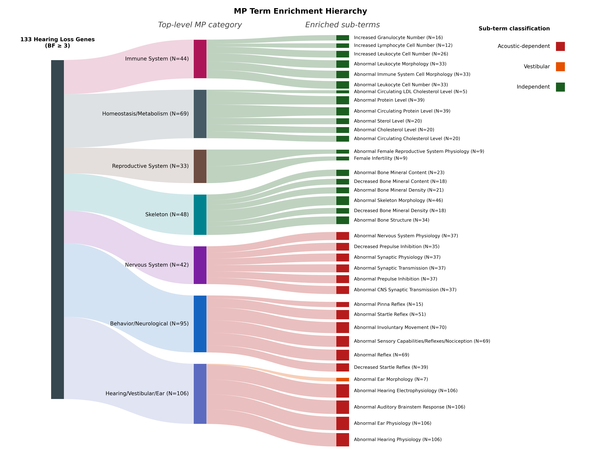
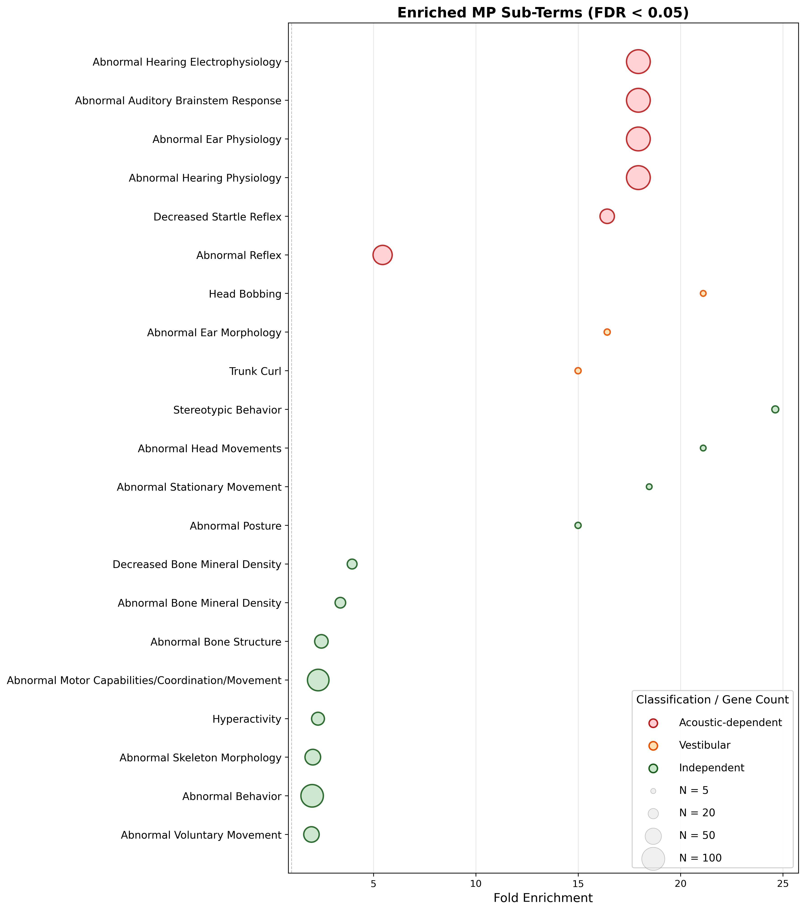

# Gene Set Enrichment Analysis: Results Summary

Analysis date: 2026-04-10

## Overview

Tested whether genes identified as auditory phenodeviants by our Bayesian mixture model (133 genes, 139 alleles with BF >= 3) are enriched for other phenotypic categories across the IMPC dataset. The analysis uses Fisher's exact tests with Benjamini-Hochberg FDR correction, applied at every level of the Mammalian Phenotype (MP) ontology hierarchy.

**Foreground**: 133 unique genes with Bayes Factor >= 3 (substantial evidence of hearing loss)
**Background**: 6,549 unique genes analysed in the Bayesian pipeline (complete ABR data, met inclusion criteria)
**Phenotype data source**: IMPC genotype-phenotype assertions (67,350 significant calls across all phenotyping procedures, Data Release 22.1)
**MP ontology**: 14,695 terms, 19,487 parent-child relationships (OBO release 2025-03-19)

---

## Stage 2: Top-Level MP Term Enrichment

7 of 24 top-level MP categories significantly enriched (FDR < 0.05):

| MP Category | OR | Foreground (a) | Background total | Fold enrichment | p_adj |
|---|---|---|---|---|---|
| hearing/vestibular/ear | 123.29 | 106 | 304 | 17.17 | 1.15e-121 |
| behavior/neurological | 4.64 | 95 | 2,340 | 2.00 | 3.45e-16 |
| nervous system | 4.55 | 42 | 633 | 3.27 | 8.77e-12 |
| skeleton | 2.83 | 48 | 1,116 | 2.12 | 4.54e-07 |
| reproductive system | 2.00 | 33 | 943 | 1.72 | 4.45e-03 |
| homeostasis/metabolism | 1.57 | 69 | 2,679 | 1.27 | 2.54e-02 |
| immune system | 1.60 | 44 | 1,558 | 1.39 | 3.06e-02 |

*Figure 1. Three-level Sankey diagram showing the flow from 133 hearing loss genes (BF >= 3) through significantly enriched top-level MP categories to their enriched sub-terms. Sub-term nodes are coloured by circularity classification: red = acoustic-dependent, orange = vestibular, green = independent. Node heights are proportional to the number of foreground genes (sqrt-scaled).*

### Comparison with Vicencio-Jimenez et al. (2026)

Vicencio-Jimenez report for their 331 IMPC-annotated hearing loss genes (Data Release 23.0):
- Behavioral: OR=3.13 — we find OR=4.64
- Cognitive: OR=1.98 — we find abnormal cognition OR=2.25 at the sub-branch level
- Emotional: OR=2.11 — we find abnormal emotion/affect OR=2.27 at the sub-branch level

Our analysis additionally identifies skeleton (OR=2.83), reproductive (OR=2.00), homeostasis/metabolism (OR=1.57), and immune (OR=1.60) enrichments not reported by Vicencio-Jimenez.

---

## Stage 3: Hierarchical Enrichment and Circularity Assessment

525 terms tested across all descendant branches of the 7 significant top-level categories. 157 terms reached significance (FDR < 0.05).

### Two-pass circularity classification

**Pass 1 (keyword/ontology)**: Classifies terms using acoustic keywords in the term name (e.g. "startle", "pinna reflex", "hearing") and position in the MP ontology (terms under the hearing/vestibular/ear branch). Caught 10 terms.

**Pass 2 (procedure-based)**: For terms classified as "independent" in Pass 1, checks what fraction of foreground genes' evidence for that term comes from acoustic-dependent procedures (ACS, ABR, CSD pinna reflex). If >= 80% of genes' evidence is acoustic-derived and N >= 5, reclassifies to acoustic-dependent. Caught 8 additional terms that had non-acoustic names but were driven almost entirely by acoustic test results.

### Classification summary (after both passes)

| Classification | Terms tested | Terms significant |
|---|---|---|
| Independent | 499 | 136 |
| Acoustic-dependent | 20 | 18 |
| Vestibular | 6 | 3 |

### Acoustic-dependent terms (circular — expected in deaf mice)

#### Caught by Pass 1 (keyword/ontology): 10 terms

| Term | OR | a | p_adj | Source |
|---|---|---|---|---|
| abnormal hearing physiology | 132.23 | 106 | 2.09e-125 | IMPC_ABR |
| abnormal ear physiology | 132.23 | 106 | 2.09e-125 | IMPC_ABR |
| abnormal auditory brainstem response | 132.23 | 106 | 2.09e-125 | IMPC_ABR |
| abnormal hearing electrophysiology | 132.23 | 106 | 2.09e-125 | IMPC_ABR |
| decreased startle reflex | 33.71 | 39 | 9.59e-37 | IMPC_ACS |
| abnormal startle reflex | 10.71 | 51 | 2.64e-27 | IMPC_ACS, SHIRPA |
| abnormal prepulse inhibition | 8.17 | 37 | 6.89e-18 | IMPC_ACS |
| decreased prepulse inhibition | 8.56 | 35 | 9.83e-18 | IMPC_ACS |
| abnormal pinna reflex | 38.71 | 15 | 5.98e-16 | SHIRPA |
| absent pinna reflex | 38.71 | 15 | 5.98e-16 | SHIRPA |

#### Caught by Pass 2 (procedure-based): 8 terms

These terms have non-acoustic names but are driven almost entirely by acoustic procedures:

| Term | OR | a | Acoustic/Total | Reason |
|---|---|---|---|---|
| abnormal CNS synaptic transmission | 8.17 | 37 | 36/37 (97%) | Nearly all from ACS (PPI) |
| abnormal synaptic transmission | 8.17 | 37 | 36/37 (97%) | Same gene set as above |
| abnormal synaptic physiology | 8.17 | 37 | 36/37 (97%) | Same gene set |
| abnormal nervous system physiology | 7.80 | 37 | 36/37 (97%) | Same gene set |
| abnormal reflex | 11.39 | 69 | 66/69 (96%) | Startle + pinna reflex dominated |
| abnormal sensory capabilities/reflexes/nociception | 11.19 | 69 | 66/69 (96%) | Same gene set as reflex |
| abnormal involuntary movement | 10.61 | 70 | 63/70 (90%) | Startle-dominated |
| limb grasping | 3.48 | 8 | 7/8 (88%) | Mostly from CSD reflex assessment |

The "synaptic transmission" terms are a particularly important catch — they look genuinely neurological but are almost entirely driven by PPI (prepulse inhibition) from the acoustic startle procedure. Without the procedure-based pass, these would have been reported as independent neurological enrichments.

### Vestibular terms (inner ear co-morbidity)

| Term | OR | a | p_adj |
|---|---|---|---|
| abnormal ear morphology | 25.40 | 7 | 1.12e-07 |
| head bobbing | 37.84 | 6 | 1.03e-06 |
| trunk curl | 22.22 | 7 | 1.22e-06 |

### Other enrichments

#### Behavioral / Neurological

| Term | OR | a | p_adj | Procedure type |
|---|---|---|---|---|
| hyperactivity | 2.77 | 31 | 2.97e-05 | Open field |
| increased vertical activity | 4.65 | 12 | 1.43e-04 | Open field |
| decreased anxiety-related response | 3.56 | 15 | 2.68e-04 | Open field / Light-dark |
| abnormal anxiety-related response | 3.32 | 17 | 2.32e-04 | Open field / Light-dark |
| abnormal gait | 4.39 | 11 | 3.65e-04 | SHIRPA / Grip strength |
| abnormal associative learning | 7.17 | 6 | 1.05e-03 | Fear conditioning |
| abnormal cognition | 2.25 | 19 | 5.52e-03 | Fear conditioning / Open field |
| abnormal contextual conditioning | 7.07 | 4 | 8.06e-03 | Fear conditioning |
| decreased grip strength | 2.51 | 13 | 8.31e-03 | Grip strength |
| decreased locomotor activity | 2.34 | 15 | 8.31e-03 | Open field |
| tremors | 3.59 | 5 | 2.88e-02 | SHIRPA |
| increased thermal nociceptive threshold | 97.94 | 2 | 3.13e-03 | Hot plate / Hargreaves |

#### Skeleton

| Term | OR | a | p_adj |
|---|---|---|---|
| decreased bone mineral density | 4.72 | 18 | 8.85e-06 |
| abnormal bone mineral density | 4.03 | 21 | 9.11e-06 |
| abnormal bone structure | 3.05 | 34 | 8.85e-06 |
| abnormal radius morphology | 49.33 | 3 | 9.79e-04 |
| abnormal ulna morphology | 49.33 | 3 | 9.79e-04 |
| abnormal humerus morphology | 36.99 | 3 | 1.50e-03 |

#### Homeostasis / Metabolism

| Term | OR | a | p_adj |
|---|---|---|---|
| abnormal circulating cholesterol level | 2.85 | 20 | 7.38e-03 |
| abnormal circulating LDL cholesterol level | 9.99 | 5 | 7.93e-03 |
| increased circulating alkaline phosphatase | 2.68 | 19 | 8.14e-03 |
| abnormal lipid level | 2.33 | 24 | 8.40e-03 |
| abnormal glucose homeostasis | 1.85 | 28 | 2.64e-02 |

#### Reproductive

| Term | OR | a | p_adj |
|---|---|---|---|
| female infertility | 5.22 | 9 | 2.68e-03 |

#### Immune

| Term | OR | a | p_adj |
|---|---|---|---|
| abnormal leukocyte cell number | 2.28 | 33 | 6.11e-03 |
| increased leukocyte cell number | 2.30 | 26 | 1.55e-02 |
| decreased T cell number | 4.62 | 6 | 3.78e-02 |

*Figure 3. Dot plot of enriched MP sub-terms (FDR < 0.05), ordered by classification: acoustic-dependent (top, red), vestibular (middle, orange), independent (bottom, green). Dot size is proportional to the number of foreground genes. Fold enrichment indicates the ratio of the observed to expected rate of the term in foreground genes.*

---

## Stage 3b: Circularity Filter — Full vs. Acoustic-Filtered Comparison

After removing 18 acoustic-dependent MP terms (10 keyword-caught + 8 procedure-caught) and re-running top-level enrichment:

| MP Category | Full OR | Filtered OR | Full sig? | Filtered sig? | Interpretation |
|---|---|---|---|---|---|
| nervous system | **4.55** | **1.02** | YES | **no** | **Entirely circular** — driven by PPI, startle, pinna reflex, synaptic transmission terms |
| behavior/neurological | 4.64 | 2.41 | YES | YES | Partially circular — survives with reduced OR |
| hearing/vestibular/ear | 123.29 | 25.40 | YES | YES | Expected; residual = ear morphology (vestibular) |
| skeleton | 2.83 | 2.83 | YES | YES | Unaffected |
| reproductive system | 2.00 | 2.00 | YES | YES | Unaffected |
| homeostasis/metabolism | 1.57 | 1.57 | YES | YES | Unaffected |
| immune system | 1.60 | 1.60 | YES | YES | Unaffected |

The nervous system phenotype enrichment (OR=4.55), which would appear highly significant in a naive analysis, is **entirely driven by acoustic-dependent tests** (PPI, startle reflex, pinna reflex, and their parent terms like "synaptic transmission" and "nervous system physiology"). Once these are removed, OR drops to 1.02 — no enrichment at all.

The behavior/neurological enrichment is **partially circular** but **survives filtering** (OR drops from 4.64 to 2.41). The surviving signal comes from genuinely independent behavioral tests: open field (hyperactivity, anxiety), fear conditioning (learning/memory), grip strength, and gait assessment.

---

## Stage 4: Centre-Matched Sensitivity Analysis

Centre-matched results (only counting MP assertions from the same centre as the gene's ABR data) are consistent with the unmatched analysis:

| MP Category | Unmatched OR | Centre-matched OR | Centre-matched sig? |
|---|---|---|---|
| hearing/vestibular/ear | 123.29 | 123.94 | YES |
| behavior/neurological | 4.64 | 4.57 | YES |
| nervous system | 4.55 | 4.50 | YES |
| skeleton | 2.83 | 2.71 | YES |
| reproductive system | 2.00 | 2.01 | YES |
| homeostasis/metabolism | 1.57 | 1.62 | YES |
| immune system | 1.60 | 1.64 | YES |
| adipose tissue | 1.88 (NS) | 1.92 | YES (p_adj=0.043) |

Centre matching slightly strengthens some effects and brings adipose tissue to significance. The enrichment patterns are not driven by cross-centre confounding. The high match rate (47,669 matched vs 1,767 unmatched assertions, 96.4%) reflects the IMPC's standardised pipeline where most phenotyping occurs at the same centre.

---

## Summary for Manuscript

1. Hearing loss genes identified by Bayesian analysis are enriched for behavioral/neurological (OR=4.64), skeleton (OR=2.83), reproductive (OR=2.00), metabolic (OR=1.57), and immune (OR=1.60) phenotypes.

2. The **nervous system enrichment is entirely circular** — driven by acoustic-dependent tests (PPI, startle, pinna reflex, and their parent terms "synaptic transmission" and "nervous system physiology" which are derived from the same PPI data). Once these are removed, OR drops to 1.02. This directly challenges naive enrichment analyses that report nervous system associations without filtering.

3. The **behavioral enrichment survives circularity filtering** (OR=2.41 after removing acoustic terms), with genuinely independent contributions from hyperactivity (open field), anxiety (open field/light-dark), learning/memory (fear conditioning), and grip strength.

4. **Skeleton enrichment** (OR=2.83) is robust and unaffected by acoustic filtering. Driven by decreased bone mineral density (DEXA) and limb bone abnormalities (X-ray) — suggesting shared developmental pathways between inner ear and skeletal structures.

5. **Metabolic enrichment** includes cholesterol, lipid, and glucose homeostasis abnormalities — all from clinical chemistry (robust, objective tests).

6. Centre matching does not alter conclusions.

7. The two-pass circularity classifier (keyword + procedure-based) is essential — the keyword-only approach misses 8 terms that look neurological but are acoustically driven, including "synaptic transmission" (97% from PPI) and "abnormal reflex" (96% from startle/pinna).
